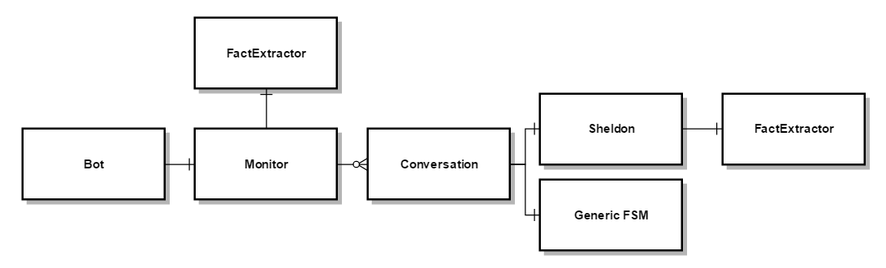
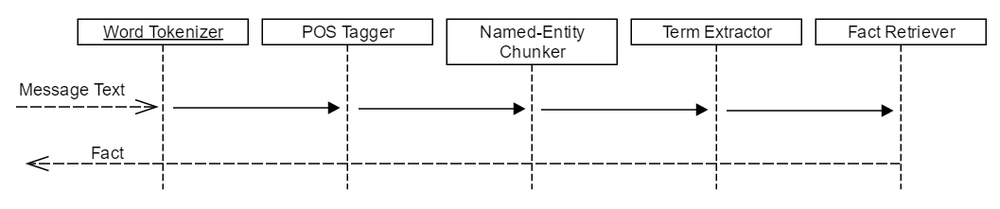

# Lab4 : Sheldon Chatbot
By: Skylar Durst, Ivan Pachev, and Jeremy Kerfs

CPE 582 - Spring 2016 - Foaad Khosmood

## Description

### System Design

Our system design consists of several components, which are depicted in Figure 1:

* Bot
    * This component simply gets each incoming message from the IRC channel and passes it to the monitor.
    * The Bot also submits outgoing messages to the IRC channel.
* Monitor
    * This component manages Conversations by maintaining a mapping between conversation partner name and Conversation.
    * The Monitor uses this mapping to submit incoming messages from the Bot to the conversation associated with that conversation partner.
* Conversation
    * This component keeps track the personality associated with the conversation, as well as a message queue and a thread used to process the conversation.
* Personality (Sheldon/Generic)
    * These personalities dictate how the incoming response is processed and how the outgoing response is created.
    * Depending on how the conversation is started, we choose the appropriate personality.
        * Generic FSM is the phase 2 complex greeting personality.
        * Sheldon is our phase 3 personality and uses the fact extractor to extract important noun phrases from incoming messages and uses them to look up relevant data in the corpora to produce an outgoing message.
* Fact Extractor
    * This component contains our preprocessing pipeline that is used to extract noun phrases in incoming messages.
    * The noun phrases are then looked up in our corpora to produce relevant sentences.

### Preprocessing pipeline

We use a preprocessing pipeline in order to extract information from all incoming messages, which is illustrated in Figure 2.
The pipeline takes as input a string containing the input message.
The incoming message string is processed using of the following stages in our pipeline:

1. Word tokenizer
    * The word tokenizer divides messages into words for further processing
1. Lemmatizer
    * The lemmatizer replaces words with their more common, synonymous counterparts.
    * This facilitates more accurate POS tagging, named entity recognition, and noun-phrase extraction.
1. POS tagger
    * The POS tagger attempts to categorize the words in the message based on their parts of speech.
    * We use the built-in, pre-trained POS tagger in NLTK.
1. Named-Entity Recognizer
    * The named entity recognizer attempts to determine if any of the tokens in the message are named entities.
    * It also combines terms that it believes are part of the same named entity.
        * For example, "Los Angeles" will be grouped as one named entity.
    * We use the built-in pre-trained NER in NLTK.
        * It does not perform very well, but it seems to do well enough for this purpose, especially combined with the next step.
        * It seems to miss obvious named entities that are not capitalized, such as "california".
1. RegExp Parser
    * We use a regular expression parser to extract noun phrases from the POS and NE-tagged tokens.
    * Our RegExp parser prioritizes noun phrases containing named entities, but also extracts normal noun phrases.
        * We are able to extract and prioritize noun phrases containing named entities because our grammar allows us to label them differently.

The output of the pipeline is a list of noun phrases, organized with the noun phrases containing named entities first.
This helps us try to pick the most important noun phrase, which we can then lookup in our corpus to pull out facts.

## Implementation
Our bot is able to handle multiple conversations at the same time by maintaining a mapping between conversation partner and Conversation object.
The monitor handles starting or joining a conversation, which involves constructing an appropriate Conversation object.
The monitor also feeds messages from relevant conversation partners to the appropriate Conversation by inserting it into the Conversation's incoming message queue.

Based on whether we can extract relevant noun phrases in the initial message using our named-entity noun phrase extractor, we choose between the phase 2 personality or the phase 3 personality when creating a Conversation.
If the Monitor decides to start a Conversation, it defaults to the phase 2 (complex greeting) personality.
If we use the complex greeting personality for a Conversation, after the greeting is complete, we switch to the sheldon personality.

The Conversation contains a thread that runs a loop that processes each message in the incoming message queue and handles timeouts if the message queue is empty for too long.
Each personality that is used is passed a callback that can be used to send outgoing messages through IRC to the Conversation's appropriate target user.
Because conversations are running in separate threads, it is necessary to create a lock around the method used to send IRC messages so that different conversations cannot send messages at the same time.

The complex greeting personality is simply an implementation of the state machine described in the phase 2 specifications of the lab assignment.
The sheldon personality uses the noun-phrase extractor to lookup relevant senteces in the corpora and produces a sassy message incorporating the relevant sentences.

We used the approach described in (3) to use NLTK's named entity recognizer.
Our RegExp parser tags noun phrases containing named entities as EP, and tags normal noun phrases as NP.
The grammar we use for our RegExp parser is based from the grammar used in (1) and (2), but also adds support for separately extracting noun phrases containing named entities.
Here is our RegExp parser noun phrase extraction grammar:

~~~~
NOUN:
    {<VBG|NN.*|JJ|>*<NN.*>}

ENTITY:
    {<VBG|NN|NE.*|JJ|>*<NE.*>}
    {<NE.*><VBG|NN|NE|JJ|>*<NN.*>}

EP:
    {<NOUN|ENTITY><IN>?<ENTITY>}
    {<ENTITY><IN>?<NOUN|ENTITY>}
    {<ENTITY>}

NP:
    {<NOUN>}
    {<NOUN><IN>?<NOUN>}
~~~~

## Comments

This was a pretty quickly-crafted approach that does not really use custom trained machine learning approaches, as we would have to find or produce training data and then tune our learning approach.
However, if we had more time, we could classify the type of incoming message based on whether it's a question, what type of question, etc. so we can produce a more suitable reply.
In addition, we might be able to use parse trees, bigrams, and other NLP techniques to produce new sentences rather than combining hardcoded data with data from the corpora.
Originally, we were looking up data from wikipedia on-the-fly, but we decided it's much faster to use locally stored corpora.

Regarding testing our chatbot, we had a few unit tests to test components like the noun phrase extractor, but most of the testing was done by hand.
Hand testing is a reasonable approach due to us needing to see whether the bot could sustain a conversation with a person.

\pagebreak

## Corpora

    Content                 Url
-------------------------   ----------------------------------------------------------
Sheldon Quotes              [http://the-big-bang-theory.com/quotes/character/Sheldon/](http://the-big-bang-theory.com/quotes/character/Sheldon/)
Physics Facts                [https://en.wikipedia.org/wiki/Category:Concepts_in_physics](https://en.wikipedia.org/wiki/Category:Concepts_in_physics)
Computer Sciencist Facts     [https://en.wikipedia.org/wiki/List_of_computer_scientists](https://en.wikipedia.org/wiki/List_of_computer_scientists)
Astonomy Facts               [https://en.wikipedia.org/wiki/Outline_of_astronomy](https://en.wikipedia.org/wiki/Outline_of_astronomy)
Computer Science Facts       [http://corpus.byu.edu/wiki/](http://corpus.byu.edu/wiki/)

Table: Corpora used in Chatbot

## Other Resources

Noun phrase extraction:

1. http://lexitron.nectec.or.th/public/COLING-2010_Beijing_China/PAPERS/pdf/PAPERS065.pdf
2. https://gist.github.com/alexbowe/879414

Named Entity Extraction:

3. http://www.nltk.org/book/ch07.html

